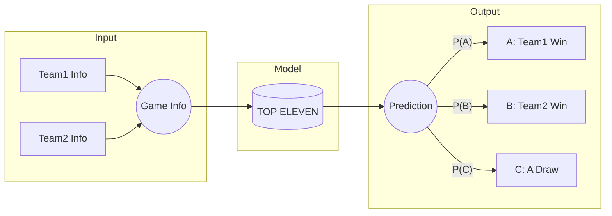

# top_eleven

## Objective
This project aims to learn a model that predicts the outcome of a football game, based on information of the two teams that are going to play the game.

```mermaid
graph LR;
    subgraph Input
        team1[Team1 Info];
        team2[Team2 Info];
        game((Game Info));
    end
    subgraph Model
        model[(TOP ELEVEN)];
    end
    subgraph Output
        pred((Prediction));
        team1_win[A: Team1 Win];
        team2_win[B: Team2 Win];
        draw[C: A Draw];
    end
    team1-->game;
    team2-->game;
    game-->model;
    model-->pred;
    pred--P(A)-->team1_win;
    pred--P(B)-->team2_win;
    pred--P(C)-->draw;
```
