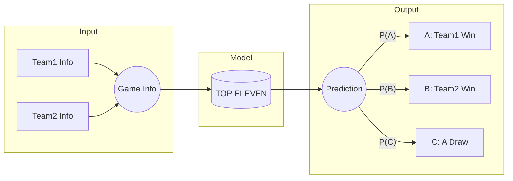
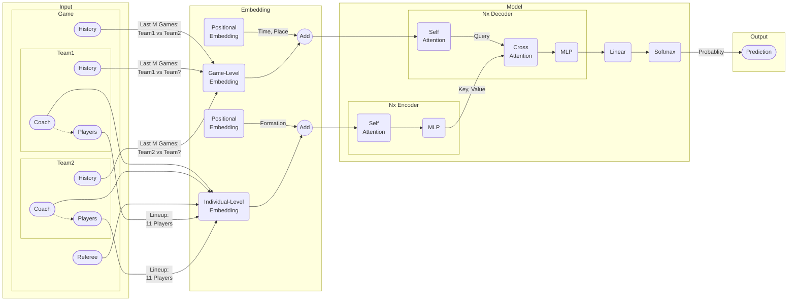

# top_eleven

## Objective
This project aims to learn a model that predicts the outcome of a football game, based on information of the two teams that are going to play the game.

## Problem Formulation

This is essentially a multi-class classification problem, where the number of classes $K=3$.

The expected output of the model is the predicted probability for each class:
* $P(A) \in [0, 1]$: The probability for event $A$ that *Team1* wins the game.
* $P(B) \in [0, 1]$: The probability for event $B$ that *Team2* wins the game.
* $P(C) \in [0, 1]$: The probability for event $C$ that the game ends in a draw.

Note that $P(A) + P(B) + P(C) = 1$.

## The Model

The model is a standard Transformer which follows the general encoder-decoder framework.

